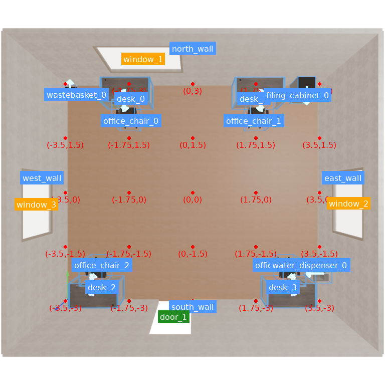
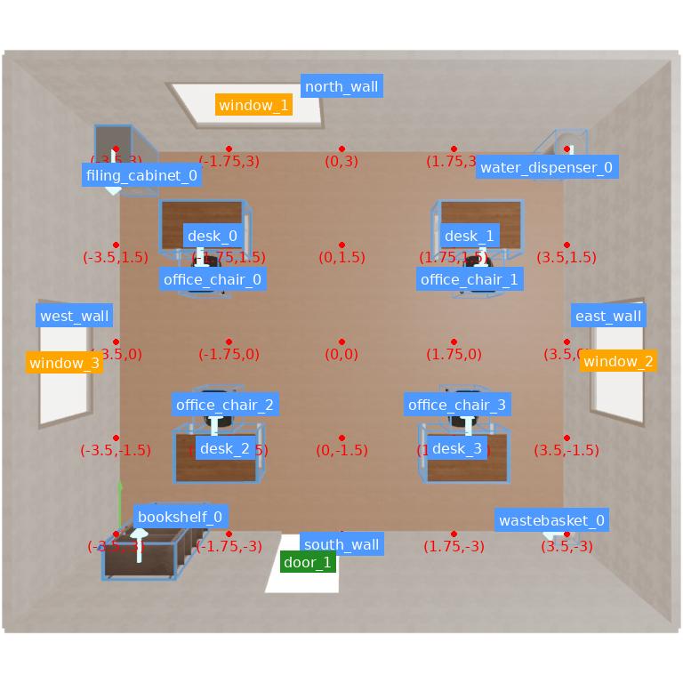

# SceneExpert 项目阶段工作报告

**汇报周期：2026 年 9 月 11 日至 9 月 29 日**

**团队：Agentic System Team / SceneExpert**

## 本期进展概述

本期工作的重点是把 Slow Memory 的研究设计落实为可执行、可审计的数据采集与后训练流程。我们保留既有 TaskCompiler、Global Planner、Harness 和 Fast Memory 框架，围绕 Qwen3.8 补齐了双候选独立执行、候选结果评判、SceneEval 批量采集、DPO 数据筛选、单卡 QLoRA 训练及实验交付。

- **采集链路已贯通。** 在相同决策上下文中生成两个 Qwen 候选，分别执行工具、保存原始场景并评判，支持数据导出和独立复核。早期办公室样本已获得一对有真实功能差异支撑的偏好数据。
- **已完成首轮 SceneEval 批量采集。** 019 批次共尝试 72 个任务，保留 55 个完整且证据有效的决策组、110 条候选轨迹，导出 22 对可训练偏好数据，其中训练集 15 对、验证集 7 对。
- **已验证单卡后训练可执行。** 在 1 张 H100 80GB 上，使用完整 19,273-token 最长训练样本完成两次优化器更新，保存有效 LoRA adapter，峰值 CUDA 分配为 54.74GiB。
- **已完善实验交付与复现。** 支持固定任务划分、冻结采集记忆、分批恢复、轻量打包、内容校验以及本地/GitHub/CCI 同步。9 月 29 日完成开发分支对最新 `main` 的 rebase。

当前已验证数据与训练基础设施。**020 正式 pilot 在本报告取证时尚未启动，尚无 Slow Memory 训练后提升场景质量的实验结论。** 本期成果为后续方法验证提供了可执行基础，仍需补齐有效训练信号与场景级对照结果。[S02][S03][S04]

## 1. 与 9 月 11 日汇报的衔接

上一份汇报已介绍 Fast Memory 生命周期、空间经验与上下文绑定、Skill 候选晋升、Harness 与评估控制，并报告了 15 个场景的 Fast Memory 开关对照：OFF 完成 10/15，ON 完成 12/15，共同完成 10 个场景，新增完成 2 个，没有完成转失败。[S01]

该结果是本期工作的起点。本期没有新增同口径的 Fast Memory ON/OFF 对照，不能将其再次计为 9 月 11 日之后的新收益。

| 维度 | 0911 汇报时的基础/目标 | 截至 0929 的进展 |
| --- | --- | --- |
| 在线框架 | TaskCompiler、Global Planner、Harness、Fast Memory 已形成整体框架 | 保持主体结构，完善采集与训练的外围适配 |
| Fast Memory | 生命周期、空间经验、Skill 管理及初步对照已有结果 | 明确普通在线更新和专用冻结采集两种实验条件，保护记忆隔离和复现 |
| Slow Memory 数据 | 希望获得 30–50 对有效 exact-context pairs，覆盖四个 stage、两种 Designer task type | 已实现真实 Qwen 双候选采集，019 获得 22 对；当前仅覆盖 furniture 的 `designer_initial` 首个 assistant turn |
| 模型训练 | 需建立可训练数据及后训练适配 | safetensors 基座、隔离训练环境、QLoRA/DPO 入口就绪，最长样本两步训练通过 |
| 方法效果 | Fast Memory 有小规模完成度结果 | Slow Memory 场景级收益尚未验证，原定多阶段、多任务类型覆盖目标尚未完成 |

研究目标仍是通过 Fast Memory 的经验复用、Harness 的执行约束和 Slow Memory 的参数学习，提高开源 Qwen 在 agentic scene generation 中的可靠性。本期选择先聚焦 furniture 初始决策，以限定的学习范围推进完整实验流程。

## 2. 主要实现与改进

### 2.1 统一 Qwen 运行入口，解决阻断采集的基础问题

新增专用 Qwen3.8 重采入口，为每批任务固定模型标识、独立输出目录和运行记录。GGUF 模型、视觉投影文件使用明确路径，Qwen 的模型环境变量在启动 embedding 服务时移除，防止跨服务配置污染。

针对早期 floor-plan Critic 的 grammar/结构化调用失败，将证据收集与结构化评分分开：先取得视觉、ASCII 和验证工具证据，再发起不带工具的结构化评分请求。同步保留原始异常，避免 checkpoint 诊断再次出错后掩盖主因。

此外，对真正阻断采集的共享契约做了有限修正：桌面相框归属 manipuland 阶段，显式墙面安装仍由 wall-mounted 阶段负责；坐垫、毯子等软装的座椅支撑准备度延后到可执行的软包座椅策略处理，刚性物体的支撑要求继续保留。

这些修改集中在运行入口和必要接口边界，未重构其他小组的 Designer/Critic/Repair 总体设计。[S05][S06]

### 2.2 将普通轨迹记录扩展为真实的双候选采集

005 实验虽然完成了完整场景流程并记录 26 条观察轨迹，但 12 个 Designer 决策分别属于不同上下文，同一上下文中没有两个候选，因此无法形成 DPO 对。这个结果说明，普通 Full 模式记录轨迹和 Writer replay 都不足以完成 Designer 决策偏好采集。

为此，我们在 furniture 初次 Designer 调用边界增加了可选采集适配层：

1. **保存完整决策快照。** 固定场景状态、资产、实际指令、系统提示、工具声明、模型配置、注入记忆、安全控制状态、渲染状态及随机数状态。
2. **记录实际模型输入。** 在 SDK 处理后捕获首个真实 HTTP 请求体，检查 A/B 的消息、工具、媒体及模型设置一致。
3. **分别执行 A/B。** A 保持正常主流程执行；B 从物理隔离的快照副本在独立进程中执行，拥有独立会话、可写资产和输出目录。
4. **分别保存原始结果。** 每个候选在原生末尾安全修复前保存原始状态并评分，后续修复、回滚和返回状态单独记录。
5. **证明主流程未被污染。** 检查 B 执行后 A 的状态、资产和公共记忆没有变化。主流程始终沿 A 继续，不因采集而引入在线 best-of-two 选择。

普通完整场景流程的 MemoryWriter 仍在正常终态位置更新。019 专用采集在 furniture 后停止，并读取固定记忆快照、关闭 Writer，以保证批量恢复及划分条件一致。这两种行为分别对应不同实验目的。[S05][S07][S02]

### 2.3 建立与候选真实状态绑定的评判证据

早期低产出既包含真实质量问题，也暴露了证据和任务解释的问题。我们将修复重点放在可验证的输入、状态、评判契约上。

| 问题类别 | 根因 | 本期改进 |
| --- | --- | --- |
| 快照无法序列化 | SDK 配置含 `httpx.Timeout` 等传输对象 | 保留其类型及各超时维度，增加真实 SDK 预检及字段级错误定位 |
| 评分使用过时物理结果 | Designer 最后移动物体后，缓存 physics 仍对应此前状态 | 对候选原始状态重新计算物理证据，将状态、资产、physics、报告绑定到评分 proof |
| 原生恢复被误判为不一致 | 四元数经 Drake 往返转换产生机器精度误差 | 使用有界、字段明确的等价恢复证明，同时严格验证资产副本与几何来源 |
| 任务显式要求被资产通用规则覆盖 | 落地植物被要求放在桌上，“tucked under” 被解释为前后分离 | 在独立评分 case pack 中校准显式任务契约，保留实际支撑、距离、朝向检查 |
| 多椅布局规则重复或分组冲突 | 完整分布和局部推断约束叠加，漏掉朝向/居中要求 | 恢复完整人数、边分布、间距、朝向和居中拓扑，记录 v1/v2 校准版本及替换规则 |
| 工具异常缺少可追溯证据 | 候选隔离时只留下泛化报错 | 保存精确调用、失败匹配项、限长输出、哈希及截断说明 |
| 非法参数消耗恢复预算 | 资产描述/名称/尺寸列表不齐，空尺寸经 `zip` 变成空请求 | 在预算记账和后端调用前校验参数，返回可纠正的结构化反馈 |
| 同一记录重复归档 | `hydra` 与 `latest-run` 副本在路径展开后被误判冲突 | 先比较序列化原始内容再去重，真实冲突则隔离全部版本 |

标签校准不改动候选几何、不替换原始 prompt，也不使用后续修好的场景分数追认早期候选。未完成执行、缺少对应候选、unknown 证据及真实碰撞仍会被拒收。013 的零偏好对结果和 017 的完整失败样本均被保留，没有为了数据数量强行制造负例。[S08]–[S12]

### 2.4 扩展为可恢复的 SceneEval 批量采集

新增 campaign 编排，采用固定随机种子和任务划分，将此前逐个场景运行、手工判断结果的流程扩展为分块运行、自动审计、自动导出。

- 从 SceneEval 单房间任务 ID 100–499 中构建任务池，排除此前开发使用的 0–99。
- 固定 128 个训练任务、24 个验证任务、32 个 held-out 测试任务。**这是任务池规模，不是已采集的有效偏好对数量。**
- 对本轮 72 个任务按 12 个一块推进，记录每个 attempt 的完整/失败状态，恢复时只选择未完成任务。
- 固定源码内容、模型和记忆身份，出现漂移时拒绝混批；支持无 Git 元数据的服务器环境。
- 每块独立审计，分别输出严格策略和相对偏好策略数据。系统性零完成失败会停止继续扩散。

冻结记忆种子包含 47 条成功案例、46 条失败案例和 23 个 Skill，其中 1 个 active、22 个 candidate。采集前检查已知来源任务的泄漏风险。训练/验证的精确任务 ID 不重叠，held-out 任务不进入本轮偏好训练；这不等同于已排除所有自然语言任务的语义相似性。[S02][S03]

### 2.5 调整偏好筛选策略，保留证据底线

严格要求候选达到绝对合格，会漏掉两个不完美候选之间有依据的改进。新增独立版本 `verified_relative_v1`，与 strict 同时导出，原始 accepted/rejected 结论保持不变。

新增的相对质量判定分支要求执行和工具调用完整、同一上下文、权威确定性证据齐全、约束集合一致且无 unknown。胜者质量至少达到 0.50、提升至少 0.03；硬失败不得增加，未完全合格的胜者必须减少硬失败；碰撞数量、最大穿透和总穿透均不得恶化。导出仍可接纳原有 accepted/rejected 与 hard-first 规则支持的对，并记录各自的 `preference_basis`。strict 原有策略及其 0.05 门槛单独保留。

这一调整增加的是有证据支持的相对偏好，未降低真实执行、状态一致性和物理安全证据的要求。例如 017 的 B 虽然总分更高，但最大穿透更严重，仍不能凭总分进入新增相对偏好。

训练数据另行转换为 **assistant-only 的首个 turn**，不把环境工具返回内容或传输层 call ID 当作模型学习目标。转换后相同的首步回答会被去重。这也是“原始可配对数量”与“最终可训练数量”不同的原因。[S02][S03]

### 2.6 完成 Qwen safetensors、QLoRA 和长上下文训练适配

推理采集继续使用 GGUF，训练使用共享目录中的 Qwen3.8-27B safetensors 基座。已核验 ModelScope 基座的 32 个文件（包含 18 个权重分片），建立独立 `.venv_dpo` 环境，并把 Python 3.11 运行时放到共享项目目录，使 ACP 不依赖 CCI 私有解释器路径。

训练端完成了以下适配：

- 固定 Transformers、TRL、PEFT、bitsandbytes、Liger 等依赖版本，提供独立环境准备和训练入口。
- 为当前数据建立 furniture-initial 训练 profile，采用 QLoRA 和纯 sigmoid DPO。相对胜者不叠加无条件 SFT 损失。
- 检查文本及 token 级 prompt 前缀，使用关闭 thinking 的模板边界训练已记录的可见动作，不编造未采集的隐藏推理。
- 保留完整 Transformer 上下文，仅在融合损失的大词表投影前去掉对所有行均为 loss-masked 的位置，并验证损失及梯度等价。
- 将激活卸载到 CPU；针对融合损失的 `torch.func` 与 saved-tensor hooks 冲突，仅在损失计算范围暂停 hook 注册，保留反向传播所需 tracker/stream，并在异常后恢复。
- 增加最长训练样本容量探针、真实优化器步数、非零 LoRA 更新、权重有限性检查。缺少离线验证时记录为未验证，避免误报通过。
- 增加始终不可自动部署的 `furniture_initial_pilot`：训练至少 8 个独立组、验证至少 4 对，适用于当前 15/7 数据；正常 initial profile 的 16 个训练组要求保持不变。

上述工作已将单卡完整上下文训练跑通。它验证了容量、梯度流和 adapter 保存，不代表训练后策略有效。[S02][S03][S04]

### 2.7 完善实验打包、诊断与跨环境同步

执行完成、证据有效、偏好产出、训练就绪和打包成功分别记录。对成功执行但没有合格偏好对的情况使用 `completed_no_pairs` 等明确状态，避免将所有 exit 2 都解释成程序崩溃，也避免用 ACP 界面“正常结束”替代终态证据。

轻量打包保留项目相对目录、配置、日志、指标、trace、配对/审计报告及限量媒体，记录 omissions、截断和 SHA256。模型、mesh、数据库和 replay 资产副本留在服务器。打包优先保存批次摘要、退出码和失败日志，解决后期 attempt 的关键材料被早期大文件挤出的情况。019 更新后的核验包约 65.4MiB，5,219 个文件通过校验。

9 月 29 日修正了服务器“文件已复制但 HEAD/index 未同步”的状态偏差，后续统一采用已提交的离线 Git bundle 同步，并核对提交、文件内容和工作区。当天将 28 个开发提交 rebase 到 `main@8646102`，无文本冲突，逐提交补丁等价；开发代码基线更新为 `5bec2cf`，本地、GitHub、CCI 的 1,098 个受控文件一致。

本次集成同时吸收了主干的资产检索、朝向标注和异质家具数量契约等更新，**这些内容属于跨组集成，不计为本组新增方法贡献**。DPO 专项 61 项测试通过；共享模块回归 761 项通过、21 项失败、19 项跳过，21 项失败均在独立的最新 main 快照上以相同信息复现，主要源于测试对象初始化不完整。不能将该结果表述为全仓测试全绿。[S03][S04]

## 3. 实验进展与结果

### 3.1 小规模验证的阶段性结论

| 实验 | 关键观察 | 对后续工作的作用 |
| --- | --- | --- |
| 005 | 完成 1 个五阶段场景，26 条观察轨迹；同一上下文没有双候选，DPO 对为 0 | 确认需要真正的决策分叉入口 |
| 007 | 主场景完成，双候选快照因 `Timeout` 序列化失败 | 补齐 SDK 级快照与启动预检 |
| 008–010 | A/B 隔离成立；修复旧 physics 与原生恢复问题后，两者均 accepted，仍无有效偏好对 | 验证恢复与评分正确性，接受真实零产出 |
| 011–013 | 3 个完整组、1 个不完整组；校准落地植物和座椅契约后，6 个候选均无失败检查，偏好对为 0 | 分离错误标签与真实难例，保留来源和排除记录 |
| 014–015 | 办公室组得到 1 对有效偏好，015 在原服务器资产上审计确认 | 首次形成可追溯的真实 Qwen 偏好对；两次记录属于同一对 |
| 016–017 | 016 非法资产参数阻断候选；边界校验修复后，017 双候选完整执行，但均存在真实硬失败，新增偏好为 0 | 证明执行完整与偏好有效必须分开判断 |
| 019 | 扩大到 SceneEval 批量任务，形成 22 对首步偏好数据 | 支持当前小规模训练 pilot |
| 019d–019g | 完成短/最长上下文探针，暴露并解决显存与 offload 兼容问题 | 确认 1×H100 上完整最长样本可更新并保存 adapter |

该表按实验链路归纳。日期和实现提交见附录 A；历史重评分、重审计不会被重复计算为新候选或新数据对。

### 3.2 真实偏好案例：饮水机前方通行空间

014 办公室任务在相同输入下独立执行两个 Qwen 候选。A 的办公椅进入饮水机前方的必需操作空间，违反任务显式的 `clear_access` 要求；B 调整布局后通过当次记录的核心检查。两者的新鲜物理评估均无碰撞。

| 候选 A：rejected | 候选 B：chosen |
| --- | --- |
|  |  |
| 原始分数 0.983871；1 项核心检查失败 | 原始分数 1.000000；0 项核心检查失败 |

图像直接取自服务器该组候选保存的渲染目录，未经内容修改，用于说明执行中的布局差异；偏好标签依据独立 raw-state、任务约束和评分 proof。**这是同一基座模型的两个采集候选，不是 DPO 训练前后对比。** 014/015 审计确认的是同一对样本。[S13]

原始分差约 0.01613，数据被接纳的依据是既有 hard-first 规则下的硬约束差异。记录中的策略门槛 0.05 不能写成实测提升 0.05。早期审计还发现资产级 interaction-clearance 索引缺失，该案例的结论限定在显式通行要求及已记录检查，不能用单个通过标签证明所有交互指标都已覆盖。

### 3.3 019 批量采集：数量、分母与损耗

| 指标 | 结果 | 解释 |
| --- | ---: | --- |
| 本轮尝试任务 | 72 | 首批 CCI 4 个，后续 ACP 68 个 |
| 完整、证据有效的独立决策组 | 55 / 72（76.4%） | 每组两个独立候选 |
| 有效候选轨迹 | 110 | 55 × 2 |
| 已保留但无效的组 | 13 | 不能进入偏好训练 |
| 捕获前失败任务 | 4 | 未产生有效 A/B 组 |
| strict 原始 / 首步有效偏好 | 12 / 11 | 训练 7，验证 4 |
| relative 原始 / 首步有效偏好 | 27 / 22 | 训练 15，验证 7 |
| 完整组到有效首步偏好 | 22 / 55（40.0%） | 排除无合适胜者、无有效对比、首步相同等情况 |
| 尝试任务到有效首步偏好 | 22 / 72（30.6%） | 本轮整体训练数据产出率 |
| 训练/验证精确任务交集 | 0 | 固定任务划分保持一致 |
| 用于偏好训练/选择的 held-out 测试对 | 0 | 测试任务保留 |

relative 的 22 对包含 strict 的 11 对，不能相加成 33 对。同一批源数据下，最终可训练数量由 strict 的 11 对扩展到 relative 的 22 对，体现了策略覆盖范围变化，不是训练效果提升。

本轮 ACP 约运行 16 小时 41 分钟，采集退出码为 2、打包退出码为 0，整体属于**部分成功的完整审计结果**。019 在 furniture 阶段停止，55 个完整决策组不表示 55 个五阶段场景完成。服务器独立复核约 411 秒，确认任务划分和数据格式通过。[S03][S04]

损耗可以归纳为两个层次：

- **17 个未形成有效组的任务：**10 个由 HSSD 无候选引发工具执行门禁失败，3 个缺少完整确定性证据，4 个在意图编译阶段失败。资产覆盖、实体绑定和编译输出问题不能仅靠降低偏好分差解决。
- **33 个完整但无可训练对的组：**21 个在现行策略下没有可接纳候选，7 个没有有效偏好对比，5 个在首步规范化后没有不同的 assistant 回答。需同时关注真实候选质量和训练目标位置。

### 3.4 单卡训练验证结果

| 探针 | 上下文与目的 | 结果 |
| --- | --- | --- |
| 019d | 17,976-token prompt，验证基础训练流程 | 两步训练通过；训练 282.9 秒；峰值 CUDA 分配 73.03GiB |
| 019e | 19,273-token 最长训练序列，检查容量边界 | 反向传播 OOM；进程约占 78.37GiB，额外 1.25GiB 分配失败 |
| 019f | 开启 CPU activation offloading | 暴露 `torch.func` 与 saved-tensor hooks 不兼容 |
| 019g | 完整最长序列，采用作用范围限定的 hooks 适配 | 两步训练成功；训练 321.2 秒；全流程 587.1 秒；峰值 CUDA 分配 54.74GiB |

019g 在训练集 15 对中选择最长的一对，不使用验证样本进行更新。保存的 adapter 为 318,843,864 字节，CPU 重读确认 512 个张量均有限，256 个 LoRA B 张量非零。训练损失为 0.693147；两步 warmup 检查不构成收敛或偏好学习收益证据，也没有执行离线验证。

不同探针的上下文长度和显存统计口径不同，不能据此直接计算统一的显存下降百分比。54.74GiB 是 CUDA allocated 峰值，不是进程总显存、reserved 峰值或主机内存峰值。历史 019g manifest 中的旧 `offline_validation_passed=true` 不代表做过验证，后续代码已将无验证结果改为显式未验证，历史记录保持原样。[S02][S03][S04]

## 4. 当前问题与底层判断

**第一，采集目标与训练目标的有效性仍需进一步对齐。** 当前导出的 22 对全部为 furniture 初始决策的首个 assistant turn，内容主要是 `observe_scene` 与 `designer_todo_manager`，仅一条 rejected 分支还调用了资产列表工具。整个 rollout 的结果被用于给首步动作赋予偏好，信用分配较间接，尚未直接学习物体放置或修复动作。

**第二，数据数量和覆盖不足。** 当前 15 个独立训练任务、7 个验证任务足以进行明确标注的小样本 pilot，但尚未达到原定 30–50 对、多阶段、多任务类型目标，更不足以支持强效果或泛化结论。放宽操作性最小样本数不会增加统计证据。

**第三，采集失败有不同来源。** HSSD 无候选、意图输出被截断、关系缺少 orientation、对象绑定不完整分别属于资产供给、编译和证据契约问题。应按失败类别归因，避免反复用同一个完整场景运行验证互不相关的问题，也不能将基础设施失败当成模型负例。

**第四，论文效果证据尚未形成闭环。** 当前已建立数据来源、候选执行、评判、训练入口之间的联系；还需要训练后基座/adapter 的受控场景对照，并保持任务、记忆、解码设置及评判条件一致。图片和离线偏好指标分别服务于案例说明与模型诊断，最终仍需场景级质量、约束满足和成本指标支撑方法有效性。

后续采集实现应优先考虑在共享观察之后、实际资产或布局决策之前分叉，以提高训练信号的直接性。该能力尚未作为本期已完成功能交付；现有 019 数据保持冻结，不跨上下文拼接历史轨迹。[S03]

## 5. 下一步可执行任务：020 DPO pilot

使用已审计的 019 数据，先检查有限损失、有效参数更新、验证指标和 adapter 保存。020 从原始 safetensors 基座开始，运行两个 epoch，采用 `furniture_initial_pilot`，始终标记为 `pilot_only`，不自动部署。

资源建议为 1×H100 80GB、主机内存至少 128GiB、ACP 时限 4 小时。主机内存是为 activation offloading 预留的保守规划值，尚无实测进程峰值保证。该任务预计超过一小时，应交由 ACP 执行。

| 阶段 | 预计耗时 | 人工/自动 | 依据或验收 |
| --- | --- | --- | --- |
| 准备与提交 | 3–5 分钟 | 人工 | 代码、基座、环境和真实数据预检已完成 |
| 训练及内置验证 | 1.5–2.5 小时 | 无人值守 | 依据 019g 两步约 321 秒估计，受序列长度、主机内存及共享存储影响 |
| 结果核验 | 10–20 分钟 | 人工 | 训练/打包退出码分别检查，损失有限，有参数更新和完整 manifest |
| 轻量打包 | 1–5 分钟 | 自动 | 保留目录、诊断和哈希，模型及 adapter 权重留在服务器 |

人工投入合计约 15–25 分钟，耗时区间不是保证。训练完成后，根据实际学习与验证信号确定场景级评估和后续采集设计；不预设论文结果为正。

### 训练启动命令

```bash
set -euo pipefail
cd /mnt/afs/task3_2/L202500276_lwz/projects/Task3.2-dev_lwz_pre_merge_v2

CUDA_VISIBLE_DEVICES=0 \
CAMPAIGN_ID=qwen38_sceneeval_dpo_019 \
RUN_ID=qwen38_dpo_pilot_020 \
PROFILE=furniture_initial_pilot \
BASE_MODEL=/mnt/afs/task3_2/share_model/Qwen/Qwen3.8-27B \
PACKAGE_MAX_FILE_MIB=32 PACKAGE_MAX_TOTAL_MIB=128 \
bash tmp/acp/acp_qwen38_dpo_train.sh
```

取证时 020 输出目录尚不存在。若之后已经运行该 ID，应先审查现有结果或使用明确的 checkpoint 恢复，不覆盖已有目录。新源码不用于恢复 019 采集，已审计的数据可由训练入口继续使用。

### 匹配的轻量打包命令

训练脚本自动打包并校验。单独重新打包时执行以下命令，无需重新训练：

```bash
set -euo pipefail
cd /mnt/afs/task3_2/L202500276_lwz/projects/Task3.2-dev_lwz_pre_merge_v2

PACKAGE="tmp/results/slow_memory/qwen38_dpo_pilot_020_review_$(date -u +%Y%m%dT%H%M%SZ).tar.gz"
.venv_dpo/bin/python scripts/package_sceneexpert_results.py \
  --run-id qwen38_dpo_pilot_020 --output "$PACKAGE" \
  --max-file-mib 32 --max-total-mib 128
.venv_dpo/bin/python scripts/package_sceneexpert_results.py --verify "$PACKAGE"
```

单文件上限 32MiB，入包文件总量上限 128MiB；省略和截断写入 manifest，原服务器结果不改动。下载日志中已验证的归档文件即可。

## 6. 后续 3–4 页 PPT 的内容提纲

建议使用 **4 页**，延续 0911 的“方案改动/优化、场景案例、存在问题/后续工作”结构。汇报标题并入第 1 页，不另占封面。

| 页码与标题 | 本页需要讲清的内容 | 推荐图表/素材 |
| --- | --- | --- |
| 1. 方案改动与阶段进展 | 在线框架保留；新增相同上下文双候选执行、独立证据与离线训练；当前完成的是数据和训练基础设施 | 简洁采集/训练流程图，区分已有在线组件与本期新增接口 |
| 2. 真实偏好样本与标签校验 | 办公室 A/B 的饮水机通行差异；标签来自原始候选状态；两张图均为训练前采集候选 | 本报告办公室 A/B 俯视图，配 1 项失败与 0 项失败的简短说明 |
| 3. 批量数据与单卡训练验证 | 72 任务、55 有效组、22 首步偏好、15/7 划分；完整 19,273 token 两步更新通过 | 数据漏斗或简表；19,273 token / 54.74GiB / 2 steps 三个训练验证数字 |
| 4. 当前问题与下一步 | 首步动作信号偏弱、数据与覆盖不足；020 pilot 就绪；场景级收益尚待对照验证 | 三条问题与行动，附训练预计 1.5–2.5 小时 |

正文中的两张原始服务器图片已下载并校验，可直接复用。图像来源和 SHA256 见[证据清单](evidence/sceneexpert_progress_20260911_20260929.json)。后续制作 PPT 时再按 0911 原稿核对版式与字体；不将采集候选对比写成训练效果图。

## 附录 A. 本期开发提交索引

统计范围为 `main@8646102` 之外的 28 个开发提交，不包含本报告自身提交。日期使用作者日期，避免 0929 rebase 后统一变化的提交者日期掩盖实际工作时间。哈希为 rebase 后的当前标识。

| 日期 | 提交 | 改动概述 |
| --- | --- | --- |
| 09-11 | `ce787a8` | Chore(slow-memory): Define Qwen-only paired recollection protocol |
| 09-11 | `4c363c4` | Feat(acp-collection): Add bounded Qwen3.8 Slow Memory recollection entrypoint |
| 09-11 | `da8f49a` | Fix(acp-collection): Resolve Qwen3.8 GGUF model paths |
| 09-11 | `09ec282` | Fix(acp-runtime): Isolate Qwen overrides from embedding service |
| 09-11 | `212f0e2` | Fix(floor-plan-critic): Separate Qwen evidence collection from structured scoring |
| 09-12 | `a8e3d42` | Fix(intent-contract): Align deferred manipuland ownership with support readiness |
| 09-13 | `f2668ec` | Fix(slow-memory): Audit Qwen recollection and deduplicate archived trajectories |
| 09-14 | `1b70f1d` | Feat(slow-memory): Add isolated Qwen furniture initial candidate collection |
| 09-14 | `49bad37` | Fix(slow-memory): Remove the Git dependency from ACP pair collection |
| 09-14 | `6b627db` | Feat(scene-expert): Add lightweight experiment review packaging |
| 09-14 | `f05ed44` | Fix(slow-memory): Preserve SDK timeout settings in initial candidate snapshots |
| 09-15 | `b159472` | Fix(slow-memory): Refresh raw candidate physics before preference scoring |
| 09-15 | `282afdc` | Fix(slow-memory): Verify native restoration without rejecting quaternion roundoff |
| 09-15 | `7fa4bbc` | Fix(slow-memory): Separate rescore completion from preference dataset readiness |
| 09-15 | `895fbfe` | Feat(slow-memory): Add isolated evidence audits and document 011 collection blockers |
| 09-15 | `892a637` | Fix(slow-memory): Calibrate candidate labels against explicit scene contracts |
| 09-15 | `4415da2` | Fix(slow-memory): Preserve tool failure evidence before candidate quarantine |
| 09-16 | `e26e5c4` | Fix(slow-memory): Distinguish partial review snapshots from finalized runs |
| 09-16 | `24b9141` | Chore(slow-memory): Document the verified office pair and missing-task collection plan |
| 09-17 | `df735f0` | Fix(slow-memory): Reject malformed furniture asset batches before budget accounting |
| 09-21 | `f3898c6` | Fix(slow-memory): Ground floor support and complete seating layouts in candidate labels |
| 09-21 | `96d4ca9` | Feat(slow-memory): Enable resumable SceneEval collection and verified Qwen DPO training |
| 09-21 | `b554984` | Chore(repo): Ignore local virtual environment directories |
| 09-28 | `3307d12` | Feat(slow-memory): Automatically package and verify campaign results after collection |
| 09-29 | `f580f9c` | Feat(slow-memory): Add audited pilot training and automatic result packaging |
| 09-29 | `7ac66ec` | Fix(slow-memory): Offload long-context activations and prioritize batch diagnostics |
| 09-29 | `b6e4cab` | Fix(slow-memory): Isolate fused DPO loss from activation offload hooks |
| 09-29 | `5bec2cf` | Fix(slow-memory): Finalize capacity validation and portable ACP runtime setup |

## 附录 B. 证据与引用

本报告依据实际代码、历史实验审计、原始结果元数据及 0929 的 SSH 检查整理。归档校验、原生重放、真实训练和场景效果属于不同验证层次，文中分别陈述。机器可读指标、来源路径、文件哈希及图像信息保存在[证据清单](evidence/sceneexpert_progress_20260911_20260929.json)。

| 编号 | 来源 | 支撑范围 |
| --- | --- | --- |
| S01 | 用户提供的 `C:/Users/admin/Documents/！scene_expert相关/0911进展汇报.pptx`，共 5 页 | 前一期基础、15 场景 Fast Memory 结果、30–50 对及多阶段目标 |
| S02 | [SceneEval 批量采集与训练设计](../sceneexpert_dpo_week_campaign.md) | 任务池、冻结记忆、relative 策略、训练目标、基座与 019d |
| S03 | [019 审计与 pilot 计划](../sceneexpert_dpo_019_audit_and_pilot.md) | 批量结果、根因分类、科学边界、019g、020 命令与耗时 |
| S04 | 服务器 `outputs/slow_memory/qwen38_sceneeval_dpo_019/`、`qwen38_dpo_capacity_019g/`；本地 `tmp/review_20260929/`、`tmp/rebase_20260929/` | 本报告读取的真实统计、训练 manifest、独立复核和同步验证；关键字段/哈希已固化在证据清单 |
| S05 | [005 审计](../sceneexpert_slow_memory_smoke_005.md) | 五阶段观察成功、没有同上下文候选、重复归档与导出修复 |
| S06 | 提交 `212f0e2`、`a8e3d42`，以及 [016 审计](../sceneexpert_initial_pairs_016_review.md) | floor-plan Critic 边界、阶段/支撑契约、参数校验 |
| S07 | [双候选入口设计](../sceneexpert_initial_pair_pilot.md) | 快照、隔离、原始评分、主流程和 MemoryWriter 边界 |
| S08 | [007 审计](../sceneexpert_initial_pairs_007_review.md)、[008 审计](../sceneexpert_initial_pairs_008_review.md) | SDK 序列化与旧 physics 标签问题 |
| S09 | [009 恢复设计](../sceneexpert_initial_pairs_009_recovery.md)、[010 审计](../sceneexpert_initial_pairs_010_review.md) | 原生恢复、数值误差、操作成功与偏好门禁分离 |
| S10 | [011 审计](../sceneexpert_initial_pairs_011_review.md)、[012 审计与校准](../sceneexpert_initial_pairs_012_review.md) | 失败组隔离、契约污染与 detached 校准 |
| S11 | [013 审计](../sceneexpert_initial_pairs_013_review.md) | 零偏好结果、通过候选不可随意反标、interaction 索引覆盖限制 |
| S12 | [017 审计](../sceneexpert_initial_pairs_017_review.md) | 完整执行但真实硬失败、校准 v2、物理指标不可被总分抵消 |
| S13 | [014 审计](../sceneexpert_initial_pairs_014_review.md)、[015 服务器复核](../sceneexpert_initial_pairs_015_review.md) | 办公室首对、真实功能差异、同一对去重与分差口径 |

服务器取证时间为 2026-09-29 19:22（北京时间），代码基线为 `5bec2cf`。本报告及配图随后按项目规范独立提交，同步 GitHub 与 CCI；此文档交付不会启动新的训练任务。
